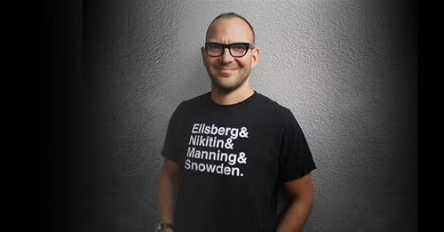

# 20260921 TechnoPolitics - Cory Doctorow
#info-politics #ai #compsci #CoryDoctorow #article #political 

https://locusmag.com/feature/commentary-cory-doctorow-technopolitics/

Cory Doctorow's Locus commentary "Technopolitics" argues that opposition to AI should focus on the political and economic conditions surrounding it, not the technology itself.  
  
## Key Arguments (mostly an AI generated summary)  
  
· Distinguish between two types of "anti-AI": Being against AI-generated slop, disinformation, corporate con jobs, and environmental harm is reasonable. Being against the underlying statistical techniques or language models themselves is "weird."  
  
· AI's problems stem from its funding bubble: The AI sector has raised over $1.4 trillion in expenditures against only ~$50 billion in annual global revenue. To justify this, companies must promise to replace all human labor and cram AI into everything—harms baked into this model of production.  
  
· Draws on Langdon Winner's "Do Artifacts Have Politics?": Some technologies have politics from their deployment (Robert Moses' racist overpasses) vs. their intrinsic nature (coal vs. solar power). AI currently has the former—contingent, not inevitable—politics.  
  
· Counterargument to "sinful origins": All technology is steeped in historical sin (Shockley's racism in microchips, Hitler's Autobahn). What matters is whether ongoing use causes new harm. Open models that no longer retain private data are usable despite their origins.  
  
· Copyright concerns miss the point: Counting words in public works isn't theft (search engines, the OED did it). The harm lies in intent to destroy livelihoods, not in training itself. It is a conduct issue, not a training-data issue.  
  
· After the bubble bursts: Open-source models, cheap hardware, and skilled workers will remain. We can choose different technopolitics, rather than the current extractive model.  
  
Conclusion: AI's technopolitics are neither inevitable nor immutable. Doctorow's central claim is that AI's harms are contingent, not intrinsic.